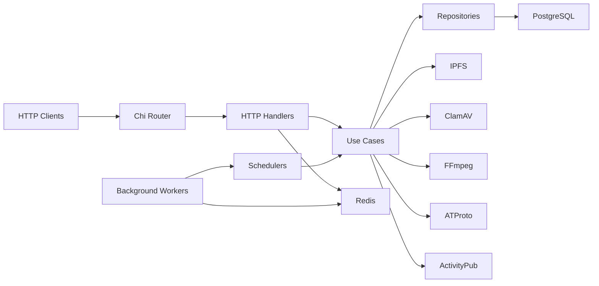
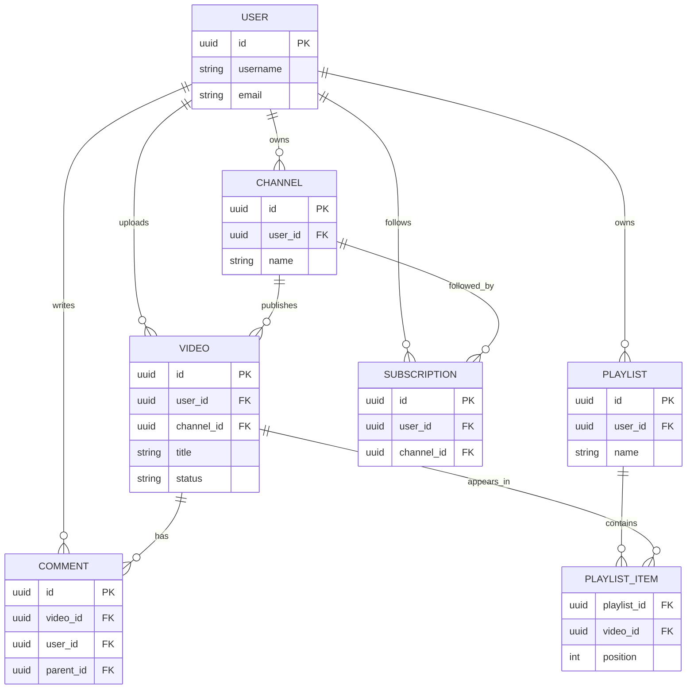
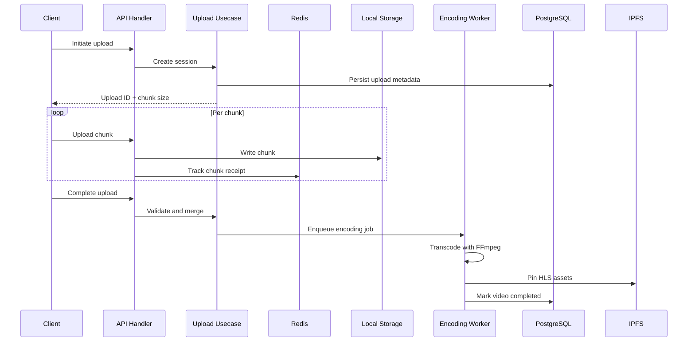

# Architecture Diagrams

This document contains canonical Mermaid diagrams for the Vidra Core system architecture.

## 1) System Architecture



## 2) Core Database ER Diagram



## 3) Video Upload and Encoding Flow



## 4) Federation Architecture

```mermaid
flowchart LR
    Vidra Core["Vidra Core Instance"] --> Outbox["ActivityPub Outbox"]
    Outbox --> SharedInbox["Remote Shared Inbox"]
    SharedInbox --> RemoteInstances["Remote ActivityPub Instances"]

    RemoteInstances --> Inbox["Vidra Core Inbox"]
    Inbox --> Verify["HTTP Signature Verification"]
    Verify --> Dedup["Deduplicate Activity"]
    Dedup --> Persist["Persist Activity"]

    Vidra Core --> ATWriter["ATProto Publisher"]
    ATWriter --> PDS["BlueSky PDS"]
    Firehose["BlueSky Firehose"] --> ATReader["ATProto Ingestion Worker"]
    ATReader --> Persist
```
