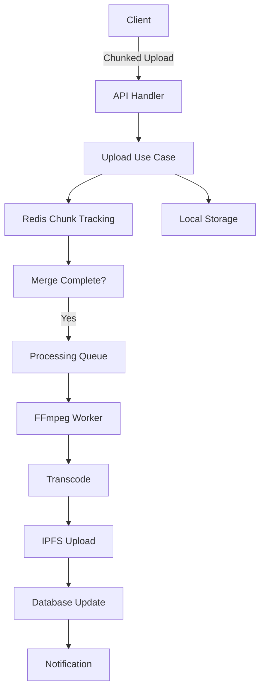

# Architecture Overview

## System Design

Athena follows clean architecture principles with clear separation of concerns and dependency inversion. The system is designed for high concurrency, scalability, and maintainability.

For canonical architecture diagrams, see [`docs/architecture/DIAGRAMS.md`](./DIAGRAMS.md).

## Core Architecture Layers

### 1. Domain Layer (`/internal/domain`)

- Pure business entities and rules
- No external dependencies
- Defines core types: Video, User, Channel, Comment, etc.
- Contains domain-specific errors

### 2. Use Case Layer (`/internal/usecase`)

- Business logic orchestration by feature (e.g., `usecase/channel`, `usecase/comment`, `usecase/views`)
- Backward-compatible aliases are kept under `internal/usecase` during migration
- Transaction coordination, validation, and rule enforcement

### Ports (`/internal/port`)

- Repository contracts and inbound/outbound interfaces shared across features
- Decouples services from concrete implementations in `internal/repository`

### 3. Interface Layer (`/internal/httpapi`)

- HTTP handlers and routing (Chi framework)
- Request/response DTOs
- Input validation and error mapping
- OpenAPI specification compliance

### 4. Bootstrap Layer (`/internal/app`)

- Application initialization and dependency wiring (central DI)
- Lifecycle management (DB, Redis, IPFS), graceful start/stop
- Background schedulers and workers (encoding, federation, firehose)
- Exposes a `Router` with routes pre-registered; `httpapi` is registration-only

### 5. Infrastructure Layer

- **Repository** (`/internal/repository`) - Database access with SQLX
- **Ports** (`/internal/port`) - Interfaces implemented by repositories/services
- **Storage** (`/internal/storage`) - Hybrid file storage (local/IPFS/S3)
- **Processing** (`/internal/processing`) - Video transcoding with FFmpeg
- **Federation** (`/internal/federation`) - ATProto integration
- **Worker** (`/internal/worker`) - Background job processing

### 6. Shared Packages (`/pkg`)

- Utilities intended for reuse (e.g., `pkg/imageutil`) that have no `internal` dependencies
- Keeps external imports possible without exposing app internals

## Key Design Patterns

### Repository Pattern

Abstracts data access behind interfaces:

```go
type VideoRepository interface {
    Create(ctx context.Context, video *domain.Video) error
    GetByID(ctx context.Context, id uuid.UUID) (*domain.Video, error)
    Update(ctx context.Context, video *domain.Video) error
    Delete(ctx context.Context, id uuid.UUID) error
}
```

### Dependency Injection

Constructor-based DI with centralized bootstrap:

**Bootstrap Package (`internal/app`):**

```go
// Application holds all dependencies and manages lifecycle
type Application struct {
    Config       *config.Config
    DB           *sqlx.DB
    Redis        *redis.Client
    Router       chi.Router
    Dependencies *Dependencies
}

// New creates and wires all dependencies
func New(cfg *config.Config) (*Application, error) {
    // Initialize database, Redis, storage dirs
    // Wire repositories and services
    // Configure schedulers and background tasks
    // Register HTTP routes
    return app, nil
}
```

**Clean Separation:**

```go
// Routes only handle HTTP concerns
func RegisterRoutesWithDependencies(
    r chi.Router,
    cfg *config.Config,
    deps *HandlerDependencies,
) {
    // Pure route registration: no connections or goroutines here
}
```

### Context Pattern

All operations accept context for cancellation and tracing:

```go
func (u *VideoUseCase) GetVideo(ctx context.Context, id uuid.UUID) (*domain.Video, error) {
    // Context flows through all layers
    return u.repo.GetByID(ctx, id)
}
```

## Data Flow

### Request Lifecycle

1. **Request arrives** at Chi router
2. **Middleware chain** processes request:
   - Request ID generation
   - Authentication/Authorization
   - Rate limiting
   - Logging
3. **Handler** validates input and calls use case
4. **Use case** orchestrates business logic:
   - Validates business rules
   - Coordinates repositories
   - Manages transactions
5. **Repository** executes database operations
6. **Response** formatted and returned

### Video Upload Flow



## Component Architecture

### Database Layer

**PostgreSQL Configuration:**

- Connection pooling (25 max connections)
- Read replica support
- Full-text search with pg_trgm
- JSONB for flexible metadata
- UUID primary keys

**Key Tables:**

- `users` - User accounts and profiles
- `channels` - Content channels
- `videos` - Video metadata and status
- `comments` - Threaded comments
- `notifications` - User notifications
- `federation_queue` - ATProto sync tasks

### Caching Layer

**Redis Usage:**

- Session storage (24h TTL)
- Rate limiting (sliding window)
- Upload chunk tracking
- Processing job status
- Hot data caching

### Storage Architecture

**Hybrid Storage Tiers:**

| Tier | Technology | Use Case | Access Time |
|------|------------|----------|-------------|
| Hot  | Local FS   | Active content | <10ms |
| Warm | IPFS       | Distributed delivery | <100ms |
| Cold | S3         | Archive/backup | <500ms |

### Video Processing Pipeline

1. **Ingestion** - Accept uploads, validate format
2. **Transcoding** - Generate quality variants (2160p→360p)
3. **Segmentation** - Create HLS chunks (4s segments)
4. **Thumbnails** - Extract preview images
5. **Distribution** - Pin to IPFS, replicate
6. **Indexing** - Update search indices

### Federation Architecture

**ATProto Integration:**

- Instance DID document
- XRPC endpoint handlers
- Bluesky firehose subscription
- Social graph synchronization

**Federation Flow:**

1. Subscribe to remote instance events
2. Queue events for processing
3. Validate signatures and content
4. Update local database
5. Trigger notifications

## Security Architecture

### Authentication & Authorization

- **JWT tokens** with HS256 signing
- **OAuth2** Authorization Code + PKCE
- **API keys** for service accounts
- **Role-based access control** (RBAC)

### Security Measures

- **Rate limiting** per user/IP
- **Request size limits** to prevent DoS
- **Input validation** at every layer
- **SQL injection prevention** via parameterized queries
- **XSS protection** through content sanitization
- **CORS configuration** for cross-origin control

## Scalability Considerations

### Horizontal Scaling

- Stateless application servers
- Database read replicas
- Redis clustering
- IPFS cluster for storage
- Load balancer distribution

### Performance Optimizations

- Connection pooling for database
- Request coalescing for duplicate fetches
- Circuit breakers for external services
- Lazy loading with pagination
- CDN integration for static assets

### Monitoring & Observability

**Metrics (Prometheus):**

- Request latency (p50, p95, p99)
- Error rates by endpoint
- Database connection pool stats
- Queue depths and processing times
- IPFS pin success rates

**Logging (Structured):**

- Request/response logging
- Error tracking with stack traces
- Performance timing
- Federation event logs

**Tracing (OpenTelemetry):**

- Distributed request tracing
- Cross-service correlation
- Performance bottleneck identification

## Development Workflow

### Local Development

```bash
# Start dependencies
docker compose up -d postgres redis ipfs

# Run migrations
make migrate

# Start server with hot reload
air

# Run tests
make test
```

### Testing Strategy

| Test Type | Coverage | Purpose |
|-----------|----------|---------|
| Unit | 80%+ | Business logic validation |
| Integration | 60%+ | Component interaction |
| E2E | Critical paths | Full system validation |
| Load | Performance targets | Capacity planning |

### CI/CD Pipeline

1. **Lint** - Code quality checks
2. **Test** - Unit and integration tests
3. **Build** - Docker image creation
4. **Scan** - Security vulnerability check
5. **Deploy** - Rolling update with health checks

## Configuration Management

### Environment Variables

Configuration follows precedence:

1. Command-line flags
2. Environment variables
3. `.env` file
4. Default values

### Feature Flags

Runtime toggles for gradual rollout:

- `FEDERATION_ENABLED` - ATProto federation
- `IPFS_ENABLED` - Distributed storage
- `TRANSCODING_ENABLED` - Video processing
- `NOTIFICATIONS_ENABLED` - Real-time updates

## Deployment Architecture

### Container Orchestration

**Docker Compose (Development):**

- Single-node deployment
- Volume persistence
- Service discovery

**Kubernetes (Production):**

- Multi-node cluster
- Auto-scaling (HPA/VPA)
- Service mesh (optional)
- Persistent volumes

### High Availability

- Multiple application replicas
- Database replication
- Redis sentinel for failover
- IPFS cluster for redundancy
- Load balancer health checks

## Future Considerations

### Planned Enhancements

- GraphQL API support
- WebRTC live streaming
- ElasticSearch integration
- Kubernetes operator
- Multi-region deployment

### Technical Debt

- Migrate to structured logging fully
- Implement event sourcing for audit
- Add request retry middleware
- Enhance test coverage
- Document API versioning strategy
