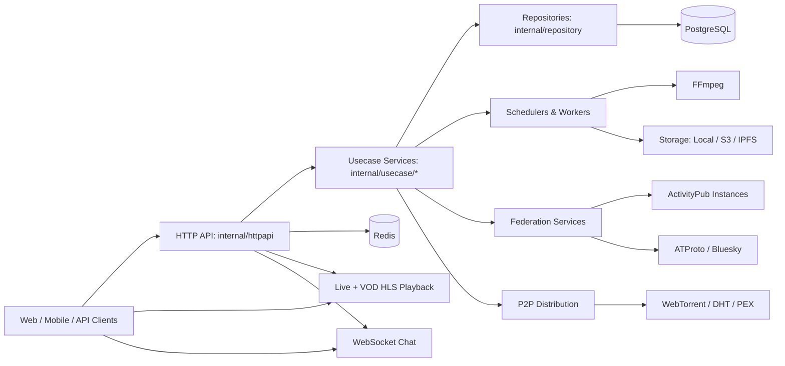
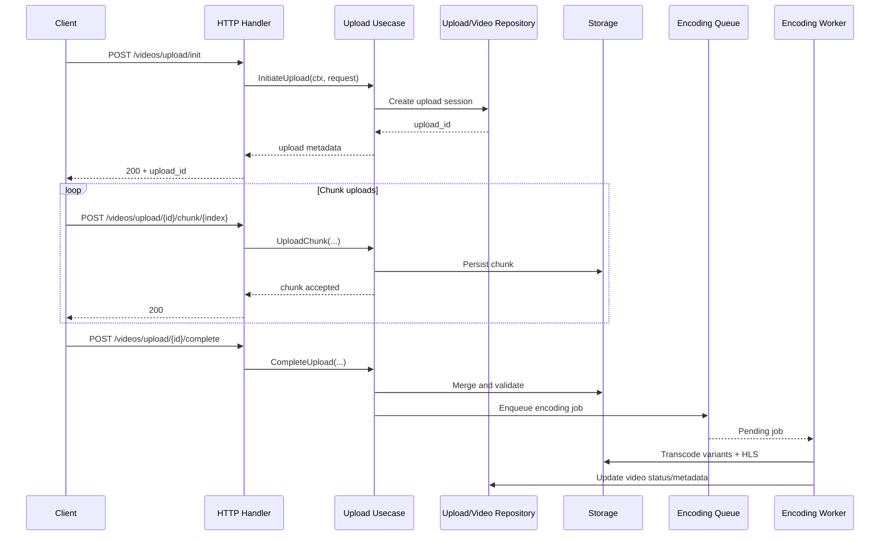
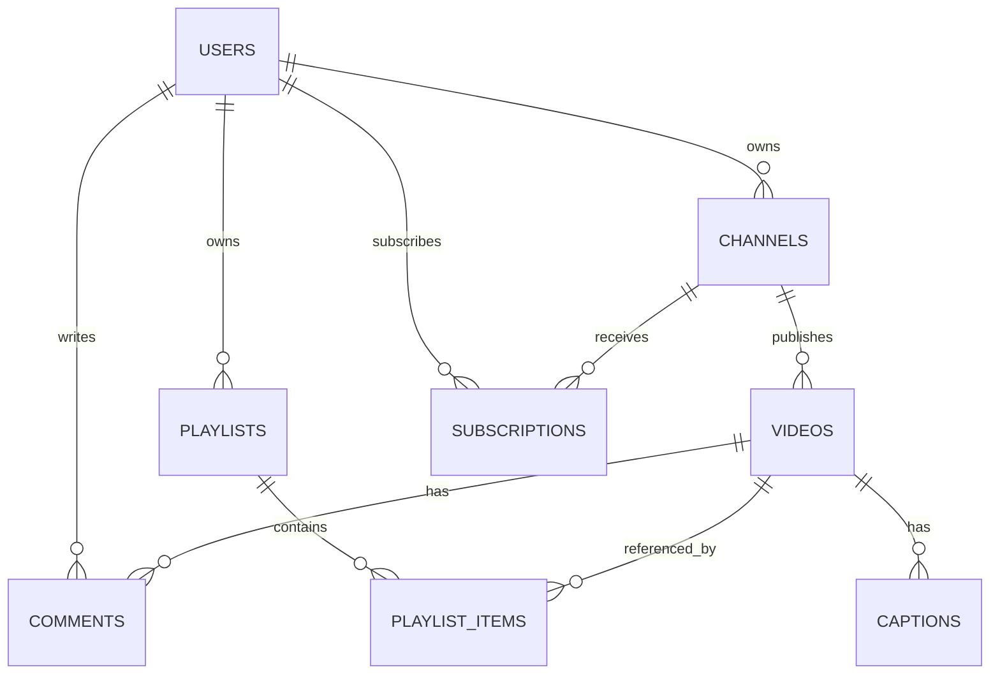

# Athena Architecture Diagrams

This document provides visual architecture references for Athena using Mermaid diagrams.

## 1) System Component Diagram

## 2) Video Upload and Encoding Sequence

## 3) Core Entity Relationship Diagram (High-level)

