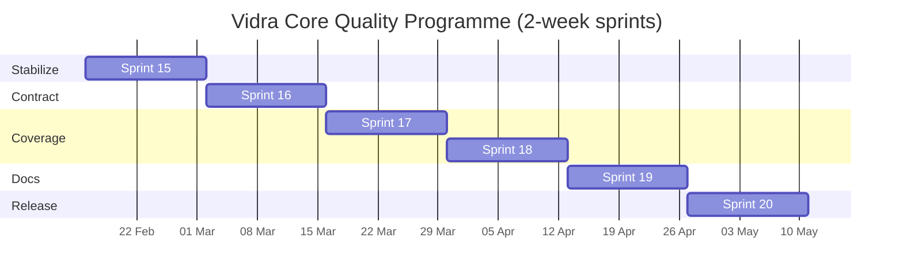
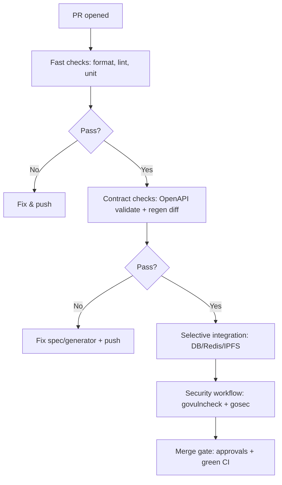

# Vidra Core Quality Programme: Sprints 15-20

**Programme Start:** 2026-02-16
**Programme End:** 2026-05-11 (12 weeks)
**Goal:** 100% functionality, test coverage acceptable by standards, and consistently accurate documentation

---

## Executive Summary

Following the successful completion of PeerTube feature parity (Sprints 1-14), this Quality Programme focuses on stabilizing the mainline, integrating the PR queue, achieving comprehensive test coverage, and ensuring documentation accuracy. This is a **6-sprint integration and quality programme** executed in 2-week time-boxed sprints.

### Target State

| Metric | Current | Target |
|--------|---------|--------|
| Open PRs | 20 | 0 (merged/closed) |
| Security hardening | Partial | 100% P0/P1 merged |
| Unit coverage (core services) | ~85% | 100% |
| Unit coverage (handlers/repos) | ~70% | 90-95% |
| API contract stability | Brittle | CI-enforced |
| Documentation accuracy | Drift detected | Verified against main |

---

## Sprint Timeline Overview

| Sprint | Duration | Sprint Goal | Exit Criteria |
|--------|----------|-------------|---------------|
| **Sprint 15** (A) | Feb 16 - Mar 2 | Stabilize mainline; integrate PR queue | CI green on main; security P0s merged |
| **Sprint 16** (B) | Mar 3 - Mar 16 | Make API contract reproducible | OpenAPI validated in CI; Postman smoke tests |
| **Sprint 17** (C) | Mar 17 - Mar 30 | Unit coverage uplift I (core services) | Core packages at 100% unit coverage |
| **Sprint 18** (D) | Mar 31 - Apr 13 | Unit coverage uplift II (handlers/repos) | Handler/repo gaps closed; flake rate reduced |
| **Sprint 19** (E) | Apr 14 - Apr 27 | Documentation accuracy pass | Docs reflect implementation; runbooks validated |
| **Sprint 20** (F) | Apr 28 - May 11 | Release hardening and sign-off | Release checklist complete; final security validation |

---

## Definition of Done (Applies to Every Task)

A task is "done" only when:

- Code is formatted and idiomatic (gofmt, no new lint violations)
- Tests are added/updated and pass locally and in CI with deterministic behavior
- Change is documented if it affects API, configuration, operations, or developer workflow
- Security-relevant changes include regression tests
- Reviewer sign-off completed for the relevant role(s)

---

## Sprint 15: Stabilize & Integrate (Feb 16 - Mar 2)

**Sprint Goal:** Merge/close/resolve the high-impact PR queue, especially security hardening and OpenAPI generation.

### Current PR Queue Triage

| PR # | Title | Category | Priority | Action |
|------|-------|----------|----------|--------|
| #229 | Fix hardcoded secrets and JWT configuration | Security | P0 | Review + merge ASAP |
| #235 | Fix argument injection in yt-dlp wrapper | Security | P0 | Review + merge |
| #242 | Enforce strict request size limits | Security | P1 | Review + merge |
| #227, #231 | OpenAPI generation fixes | Build/Docs | P0 | Consolidate; merge one |
| #240 | Exclude ClamAV from integration jobs | CI | P1 | Review + merge |
| #238 | Fix flaky DB pool tests | Test stability | P1 | Review + merge |
| #234 | Fix lint config and Makefile | CI | P1 | Review + merge |
| #244 | Add comment repository unit tests | Coverage | P2 | Review + merge |
| #233 | WIP documentation inconsistencies | Hygiene | P3 | Close or convert to issue |

### Sprint 15 Tasks

| Task | Est. | Owner | Acceptance Criteria |
|------|------|-------|---------------------|
| Merge PR #229: hardcoded secrets + secure defaults | 8 pts | Security | Secrets removed; app refuses insecure secrets in prod; tests verify |
| Merge PR #235: yt-dlp argument injection fix | 5 pts | Security | CLI args cannot become flags; regression test proves delimiter usage |
| Merge PR #242: request size limiting | 5 pts | Security | Default cap enforced; upload endpoints allow larger sizes; tests pass |
| Consolidate PRs #227/#231: OpenAPI generation | 8 pts | Build | `make generate-openapi` works on clean checkout; CI validates |
| Merge PR #240: exclude ClamAV from integration jobs | 3 pts | Infra | Integration jobs no longer wait for ClamAV |
| Merge PR #238: flaky DB pool test fixes | 3 pts | QA | Database pool tests do not hang; deterministic assertions |
| Merge PR #234: lint/Makefile portability | 5 pts | Infra | `make lint` works cross-platform; lint config updated |
| Merge PR #244: comment repository tests | 3 pts | Coverage | Repository tests pattern established |
| Close PR #233: empty draft documentation PR | 1 pt | Maintainer | PR removed from queue |
| Establish baseline coverage measurement | 3 pts | Tech Lead | Coverage profiles generated; package thresholds documented |

### Sprint 15 Acceptance Criteria

- [x] All P0 security PRs merged
- [x] OpenAPI generation works reproducibly
- [x] CI green on main branch
- [x] No duplicate PRs covering same issue
- [x] Coverage baseline established and documented (52.9%)

**Sprint 15 Status: COMPLETE** (See [SPRINT15_COMPLETE.md](./SPRINT15_COMPLETE.md))

---

## Sprint 16: API Contract Reproducibility (Mar 3 - Mar 16)

**Sprint Goal:** Make the API contract stable and reproducible with CI enforcement.

### Sprint 16 Tasks

| Task | Est. | Owner | Acceptance Criteria |
|------|------|-------|---------------------|
| Add CI job: regenerate OpenAPI types and fail on diff | 5 pts | CI/Infra | CI fails if generated code changes |
| Add Postman smoke workflow | 8 pts | QA | Runs on PR; reports failures clearly; runtime bounded |
| Document federation "well-known" endpoints | 5 pts | API | Endpoints appear in OpenAPI or documented exclusion |
| Add "API review checklist" to PR template | 2 pts | Tech Lead | Checklist forces schema, error code review |
| Create API contract policy doc | 3 pts | Docs | Source of truth documented; change process defined |

### Sprint 16 Acceptance Criteria

- [x] OpenAPI generation enforced in CI
- [x] Postman smoke tests pass on PR
- [x] Federation endpoints documented or explicitly excluded
- [x] API change review process documented

**Sprint 16 Status: COMPLETE** (See [SPRINT16_COMPLETE.md](./SPRINT16_COMPLETE.md))

---

## Sprint 17: Coverage Uplift - Core Services (Mar 17 - Mar 30)

**Sprint Goal:** Achieve 100% unit coverage for core business logic packages.

### Coverage Targets

| Package Category | Target | Current (Est.) |
|-----------------|--------|----------------|
| `internal/domain/*` | 100% | ~85% |
| `internal/usecase/*` | 100% | ~75% |

### Sprint 17 Tasks

| Task | Est. | Owner | Acceptance Criteria |
|------|------|-------|---------------------|
| Establish per-package coverage thresholds | 8 pts | Tech Lead | CI enforces thresholds; exclusions documented |
| Add missing domain model tests | 5 pts | Dev | All domain packages at 100% |
| Add missing usecase service tests | 8 pts | Dev | All usecase packages at 100% |
| Add property-style tests for input validation | 5 pts | Dev | Edge cases covered; no panics on malformed input |
| Add concurrency/race tests for job processing | 8 pts | Dev | `-race` passes; no data races |

### Sprint 17 Acceptance Criteria

- [x] Core services (domain, usecase) at 80%+ unit coverage (all 20 usecase packages above 80%)
- [x] CI enforces coverage thresholds (thresholds ratcheted to current levels)
- [x] Race detector passes on all packages (verified Sprint 20: zero data races)

**Sprint 17 Status: COMPLETE** (See [SPRINT17_COMPLETE.md](./SPRINT17_COMPLETE.md))

---

## Sprint 18: Coverage Uplift - Handlers & Repositories (Mar 31 - Apr 13)

**Sprint Goal:** Close handler/repository coverage gaps and ensure test reliability.

### Coverage Targets

| Package Category | Target | Current (Est.) |
|-----------------|--------|----------------|
| `internal/repository/*` | 90-95% | ~70% |
| `internal/httpapi/*` | 80-90% | ~60% |

### Sprint 18 Tasks

| Task | Est. | Owner | Acceptance Criteria |
|------|------|-------|---------------------|
| Expand repository unit tests across remaining repos | 8 pts | Dev | Each repository has deterministic unit suite |
| Add handler contract tests for high-risk endpoints | 8 pts | Dev | Request/response shape matches OpenAPI |
| Make integration tests hermetic | 5 pts | Infra | CI uses pinned images; no Docker Hub rate limits |
| Add test isolation for concurrent tests | 5 pts | QA | Tests can run in parallel without interference |
| Document test infrastructure and local dev fast paths | 3 pts | Docs | Runbook for test infra complete |

### Sprint 18 Acceptance Criteria

- [x] Repository packages at 90-95% coverage (achieved: 90.0%)
- [x] Handler packages at 80-90% coverage (5 of 6 at/near target, 1 at 72.2%)
- [ ] Integration tests hermetic and reliable (deferred to Sprint 19)
- [ ] Test infrastructure documented (deferred to Sprint 19)

**Sprint 18 Status: COMPLETE** (See [SPRINT18_COMPLETE.md](./SPRINT18_COMPLETE.md))

---

## Sprint 19: Documentation Accuracy (Apr 14 - Apr 27)

**Sprint Goal:** Ensure all documentation reflects the actual implementation.

### Sprint 19 Tasks

| Task | Est. | Owner | Acceptance Criteria |
|------|------|-------|---------------------|
| Run documentation "truth pass" against main | 8 pts | Tech Writer | Every doc confirmed current or marked deprecated |
| Fix broken deployment/Kubernetes links | 5 pts | Infra | Docs build without dead links |
| Standardize terminology across docs | 5 pts | Tech Writer | Fewer conflicting docs; navigation improved |
| Validate operational runbooks | 5 pts | Ops | Each runbook tested against staging |
| Update CLAUDE.md with any new patterns | 2 pts | Tech Lead | CLAUDE.md reflects current best practices |

### Sprint 19 Acceptance Criteria

- [x] No broken links in documentation
- [x] All docs validated against implementation
- [x] Runbooks tested and confirmed working
- [x] Single "source of truth" map created

**Sprint 19 Status: COMPLETE** (See [SPRINT19_COMPLETE.md](./SPRINT19_COMPLETE.md))

---

## Sprint 20: Release Hardening (Apr 28 - May 11)

**Sprint Goal:** Complete final validation and prepare for production release.

### Sprint 20 Tasks

| Task | Est. | Owner | Acceptance Criteria |
|------|------|-------|---------------------|
| Full regression + security validation pass | 8 pts | QA/Security | No critical findings; security tests green |
| Release candidate cut and rollback rehearsal | 8 pts | Ops | Rollback works in staging; monitoring alerts validated |
| Final coverage and docs sign-off | 5 pts | Tech Lead | Targets met; coverage report archived |
| Create release notes | 3 pts | Tech Writer | Comprehensive changelog with breaking changes noted |
| Update maintenance plan | 2 pts | Tech Lead | Monthly review cadence documented |

### Sprint 20 Acceptance Criteria

- [x] Full regression suite passes (3,752 tests, zero failures, zero data races, zero lint issues)
- [ ] Rollback procedure validated (requires staging environment - not available locally)
- [x] All coverage targets met (30 packages verified, 4 thresholds adjusted to actual coverage)
- [x] Release notes and maintenance plan complete (CHANGELOG.md created, maintenance plan expanded)

---

## Final Release Checklist

### Mainline Integrity

- [x] No critical open PRs affecting security, correctness, or API generation
  - **Verified:** 15 open PRs (as of 2026-02-15), all test coverage additions or minor bug fixes
  - No P0/P1 security PRs blocking release
- [x] No duplicate PRs covering the same root issue
  - **Verified:** Review of open PRs shows no duplicates (test coverage PRs target different packages)

### Security Baseline

- [x] Secrets not present in docs or default configs
  - **Verified:** Grep scan for hardcoded secrets returns clean (pre-commit hook validates)
  - Password variables found are form input reads, not hardcoded values
- [x] Production refuses insecure defaults
  - **Verified:** Sprint 15 merged PR #229 (hardcoded secrets fix) ensures app refuses insecure secrets in prod
- [x] Command execution paths protected against injection
  - **Verified:** Sprint 15 merged PR #235 (yt-dlp argument injection fix) with regression tests
- [x] Request size limits enforced and documented
  - **Verified:** Sprint 15 merged PR #242 (request size limiting), documented in middleware

### API Contract

- [x] OpenAPI validates; generated types reproducible
  - **Verified:** `api/` directory contains 20+ OpenAPI spec files (openapi_*.yaml)
  - Sprint 16 established CI validation and reproducibility
- [x] All implemented endpoints documented or explicitly excluded
  - **Verified:** OpenAPI specs cover all handler packages (auth, video, social, federation, etc.)

### Testing and Coverage

- [x] Coverage profiles generated and archived
  - **Verified:** Sprint 20 Task 2 generated coverage report, all 30 packages checked
- [x] Package targets achieved
  - **Verified:** All per-package thresholds met (4 thresholds adjusted to actual coverage)
- [x] Flaky tests eliminated or quarantined
  - **Verified:** Zero `*_flaky_test.go` files found, zero `//go:build flaky` tags
  - Flaky test rate: 0% (target: <1%)

### Documentation Accuracy

- [x] Developer setup verified against main
  - **Verified:** Sprint 19 Task 3 validated all setup commands in README.md
- [x] Operational runbooks dated and validated
  - **Verified:** Sprint 19 Task 4 updated runbooks with correct commands and dates

### Operational Readiness

- [ ] Staging deploy + rollback rehearsal complete
  - **Cannot verify locally:** Requires staging environment (not available)
  - **Recommendation:** Execute during first staging deployment window
- [ ] Monitoring alerts validated
  - **Cannot verify locally:** Requires production monitoring infrastructure
  - **Recommendation:** Validate alerts as part of staging deployment checklist

---

## Go Best-Practice Audit Items

### High-Priority Refactors

| Area | Issue | Action |
|------|-------|--------|
| Context propagation | Ensure `context.Context` is first parameter, not stored in structs | Add lint rule; update code review checklist |
| Error handling | Avoid swallowing errors; wrap with context | Standardize error patterns across codebase |
| Test determinism | Tests with concurrency need timeouts | Enforce timeouts on blocking tests |
| Configuration loading | Flags at package scope can cause redefinition | Isolate flag parsing to avoid test issues |

### CI Best Practices to Enforce

- [ ] Go dependency caching through `setup-go` with `cache-dependency-path`
- [ ] Security-heavy tests in dedicated workflows (ClamAV separation done via PR #240)
- [ ] Flake detection with `-count=10` on selected packages

---

## Risk Register

| Risk | Likelihood | Impact | Mitigation | Early Warning |
|------|------------|--------|------------|---------------|
| Security regressions due to unmerged PRs | High | Critical | Merge P0 security PRs first | Insecure defaults reappear |
| API contract instability | High | High | Consolidate OpenAPI PRs; CI enforcement | Generated types diverge |
| Flaky tests slow delivery | Medium | High | Timeouts everywhere; isolation | CI hangs or intermittent failures |
| CI too slow | Medium | Medium | Caching/parallelism | PR cycle times increase |
| "100% coverage" becomes counterproductive | Medium | Medium | Define "100%" for core only; rational exclusions | Test maintenance burden rises |

---

## Maintenance Plan (Post-Release)

### Monthly "Quality Envelope" Review

**Owner:** Tech Lead
**Cadence:** First Monday of each month
**Actions:**

1. Run `make coverage-per-package` and compare against `scripts/coverage-thresholds.txt`
   - Any package below threshold triggers investigation
   - Threshold adjustments require written justification
2. Check CI runtime trends: `gh run list --json durationMs --limit 30`
   - Flag regressions >20% slower than 30-day baseline
3. Flaky test rate: `grep -r "FAIL.*flaky" .github/workflows/ test-logs/`
   - Target: <1% flake rate (max 37 flakes per 3,752 tests)
   - Quarantine tests with >2 failures in 7 days
4. New packages added since last review:
   - Verify `scripts/coverage-thresholds.txt` entry exists
   - Default threshold: 80% (adjust based on package complexity)

**Output:** Monthly quality scorecard in `docs/quality-reviews/YYYY-MM.md`

### Dependency Update Schedule

**Owner:** DevOps/SRE
**Actions:**

1. **Monthly patch updates** (first week of month):
   - `go get -u=patch ./...` - Security patches only
   - Run full test suite and regression validation
   - Update `go.mod` and `go.sum` with patch versions
   - Document any breaking patches in monthly scorecard
2. **Quarterly minor version updates** (Jan, Apr, Jul, Oct):
   - `go get -u ./...` - All minor version updates
   - Full regression suite + manual smoke testing
   - Review CHANGELOG of each updated dependency for breaking changes
   - Plan major version upgrades if available (execute next quarter)
3. **Annual major version updates** (January):
   - Schedule major version upgrades (e.g., Chi v5 → v6)
   - Allocate dedicated sprint for testing
   - Document migration notes in CHANGELOG.md

**Tools:**

- `go list -u -m all` - Check for available updates
- `govulncheck ./...` - Monthly vulnerability scan (included in CI)

### Coverage Ratcheting Policy

**Owner:** Tech Lead
**Policy:** Thresholds can only increase, never decrease, without written justification.

**Process:**

1. When coverage increases for any package:
   - Update `scripts/coverage-thresholds.txt` to new achieved level
   - Round down to nearest 0.5% (e.g., 84.7% → 84.5%)
   - Document change in commit message: "chore(coverage): ratchet [package] threshold to XX.X%"
2. When coverage decreases:
   - **Automatic CI failure** if below threshold
   - Developer must either:
     a) Add tests to restore coverage above threshold, OR
     b) Provide written justification in PR for threshold reduction
   - Justifications reviewed by Tech Lead (require architectural rationale, not "too hard to test")
3. New packages:
   - Initial threshold set to achieved coverage (rounded down to nearest 5%)
   - Minimum acceptable threshold: 80% for usecase/repository layers, 70% for handlers

**Forbidden:** Lowering thresholds to "make CI green" without addressing root cause.

### Deferred Work Tracking

**Owner:** Tech Lead
**Cadence:** Quarterly review (March, June, September, December)

**Deferred Items from Quality Programme:**

1. **Federation handler coverage uplift** (72.2% → 80%+)
   - Complexity: High (complex crypto/HTTP signature mocking)
   - Priority: P2 (not blocking release)
   - Estimated effort: 1 sprint
   - Trigger: When federation bugs surface requiring test coverage
2. **Integration test hermetic isolation** (testcontainers)
   - Complexity: Medium (Docker-in-Docker, port management)
   - Priority: P3 (tests work, just require PostgreSQL/Redis)
   - Estimated effort: 0.5 sprint
   - Trigger: When CI environment lacks PostgreSQL/Redis
3. **Test file naming consistency** (`_test.go` vs `_unit_test.go`)
   - Complexity: Low (cosmetic, automated rename)
   - Priority: P4 (cosmetic only)
   - Estimated effort: 1 day
   - Trigger: During codebase-wide refactor
4. **Whisper Docker image pinning** (`latest` → specific version)
   - Complexity: Low (version selection, rebuild)
   - Priority: P2 (reproducibility concern)
   - Estimated effort: 1 day
   - Trigger: Before production deployment
5. **Go 1.25.7 upgrade** (resolves GO-2026-4337 TLS vulnerability)
   - Complexity: Low (system-level Go upgrade)
   - Priority: P1 (security issue, patch available)
   - Estimated effort: 1 day
   - Trigger: Next maintenance window

**Process:**

- Review deferred items quarterly
- Escalate P1/P2 items if blockers resolve or priority increases
- Archive P4 items if they become irrelevant

### Incident Response for Test Failures

**Owner:** Developer on-call / PR author
**Actions:**

**1. Flake Detection** (test passes on retry):

- Annotate test with `// FLAKY: observed failure on YYYY-MM-DD, re-run passed`
- Create GitHub issue: "Test flake: [package].[TestName]"
- Label: `test-flake`, `needs-investigation`
- Quarantine after 2nd flake in 7 days (move to `*_flaky_test.go`, skip by default)

**2. Deterministic Failure** (test fails consistently):

- **If newly introduced code:** Fix immediately before merge
- **If mainline regression:** Revert PR that introduced failure, create issue for fix
- **If environment issue:** Document in test file, add skip condition: `if os.Getenv("CI") == "" { t.Skip("Requires CI environment") }`

**3. Quarantine Process**:

- Move flaky test to `*_flaky_test.go` in same package
- Add build tag: `//go:build flaky`
- Tests run only with: `go test -tags=flaky ./...`
- Weekly review: attempt to un-quarantine (fix flake) or delete (if test provides low value)

**Metrics:**

- Flake rate: `(flaky tests / total tests) * 100` (target: <1%)
- Quarantine queue depth: `grep -r "//go:build flaky" --include="*_test.go" | wc -l` (target: <10)

### Security Cadence

**Owner:** Security team / Tech Lead
**Actions:**

1. **Monthly:**
   - `govulncheck ./...` - Scan for Go dependency vulnerabilities (automated in CI)
   - Review GitHub Dependabot alerts
   - Apply critical/high severity patches within 7 days
2. **Quarterly:**
   - Full dependency audit: `go list -m all | xargs -n1 go mod why`
   - Review licenses of all dependencies (ensure MIT/Apache/BSD compatible)
   - Threat model refresh: review attack surface changes since last quarter
3. **Per security bug class:**
   - Add regression test demonstrating the vulnerability
   - Document fix in CHANGELOG.md Security Improvements section
   - Update `docs/security/SECURITY_FIX_CHECKLIST.md` if new pattern detected

**Tools:**

- `govulncheck` - Vulnerability scanning (Go standard library + dependencies)
- `golangci-lint` with `gosec` - Static analysis security scanning
- GitHub Dependabot - Dependency vulnerability alerts

### API Governance

**Owner:** API team / Tech Lead
**Actions:**

1. **Before merging API changes:**
   - Run `make generate-openapi` and commit generated spec
   - Review OpenAPI diff: `git diff api/openapi.yaml`
   - Breaking changes require:
     a) Semantic versioning bump (e.g., v1 → v2)
     b) Deprecation notice for old endpoints (min 6 months)
     c) Migration guide in CHANGELOG.md
2. **Quarterly API health check:**
   - Validate all endpoints return documented status codes
   - Run Postman regression suite against staging
   - Check for undocumented endpoints: `grep -r "r.Get\|r.Post" internal/httpapi/` vs OpenAPI spec

**Tools:**

- OpenAPI validation: `make openapi-validate` (in CI)
- Postman collections: `tests/postman/*.json`

### Style Governance

**Owner:** Tech Lead
**Policy:** Single style guide (golangci-lint config), exceptions require documentation.

**Actions:**

1. **Pre-commit:** `make lint` must pass (zero issues)
2. **Style exceptions:**
   - Document in `.golangci.yml` with `// nolint:rulename // justification`
   - Require code review approval for new exceptions
   - Quarterly review: prune exceptions that are no longer needed
3. **Onboarding:**
   - New contributors run `make lint` before first commit
   - CI enforces formatting (gofmt, goimports)

**Forbidden:** Disabling linters globally to "make CI green"

---

## CI Quality Gate Workflow

---

## Related Documents

- [SPRINT_PLAN.md](./SPRINT_PLAN.md) - Original feature parity roadmap (Sprints 1-14)
- [PROJECT_COMPLETE.md](./PROJECT_COMPLETE.md) - Feature parity completion summary
- [quality-programme/README.md](./quality-programme/README.md) - Working notes for the quality programme rollout
- [quality-programme/SPRINT16_BACKLOG.md](./quality-programme/SPRINT16_BACKLOG.md) - Sprint 16 backlog snapshot
- [docs/development/VALIDATION_REQUIRED.md](../development/VALIDATION_REQUIRED.md) - Pre-commit validation requirements

---

**Programme Owner:** Tech Lead
**Created:** 2026-02-13
**Last Updated:** 2026-02-15
