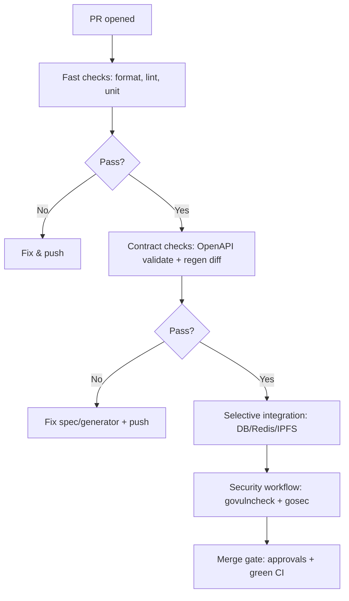

# Athena Quality Programme: Sprints 15-20

**Programme Start:** 2026-02-16
**Programme End:** 2026-05-11 (12 weeks)
**Goal:** 100% functionality, test coverage acceptable by standards, and consistently accurate documentation

---

## Executive Summary

Following the successful completion of PeerTube feature parity (Sprints 1-14), this Quality Programme focuses on stabilizing the mainline, integrating the PR queue, achieving comprehensive test coverage, and ensuring documentation accuracy. This is a **6-sprint integration and quality programme** executed in 2-week time-boxed sprints.

### Target State

| Metric | Current | Target |
|--------|---------|--------|
| Open PRs | 20 | 0 (merged/closed) |
| Security hardening | Partial | 100% P0/P1 merged |
| Unit coverage (core services) | ~85% | 100% |
| Unit coverage (handlers/repos) | ~70% | 90-95% |
| API contract stability | Brittle | CI-enforced |
| Documentation accuracy | Drift detected | Verified against main |

---

## Sprint Timeline Overview

| Sprint | Duration | Sprint Goal | Exit Criteria |
|--------|----------|-------------|---------------|
| **Sprint 15** (A) | Feb 16 - Mar 2 | Stabilize mainline; integrate PR queue | CI green on main; security P0s merged |
| **Sprint 16** (B) | Mar 3 - Mar 16 | Make API contract reproducible | OpenAPI validated in CI; Postman smoke tests |
| **Sprint 17** (C) | Mar 17 - Mar 30 | Unit coverage uplift I (core services) | Core packages at 100% unit coverage |
| **Sprint 18** (D) | Mar 31 - Apr 13 | Unit coverage uplift II (handlers/repos) | Handler/repo gaps closed; flake rate reduced |
| **Sprint 19** (E) | Apr 14 - Apr 27 | Documentation accuracy pass | Docs reflect implementation; runbooks validated |
| **Sprint 20** (F) | Apr 28 - May 11 | Release hardening and sign-off | Release checklist complete; final security validation |

---

## Definition of Done (Applies to Every Task)

A task is "done" only when:
- Code is formatted and idiomatic (gofmt, no new lint violations)
- Tests are added/updated and pass locally and in CI with deterministic behavior
- Change is documented if it affects API, configuration, operations, or developer workflow
- Security-relevant changes include regression tests
- Reviewer sign-off completed for the relevant role(s)

---

## Sprint 15: Stabilize & Integrate (Feb 16 - Mar 2)

**Sprint Goal:** Merge/close/resolve the high-impact PR queue, especially security hardening and OpenAPI generation.

### Current PR Queue Triage

| PR # | Title | Category | Priority | Action |
|------|-------|----------|----------|--------|
| #229 | Fix hardcoded secrets and JWT configuration | Security | P0 | Review + merge ASAP |
| #235 | Fix argument injection in yt-dlp wrapper | Security | P0 | Review + merge |
| #242 | Enforce strict request size limits | Security | P1 | Review + merge |
| #227, #231 | OpenAPI generation fixes | Build/Docs | P0 | Consolidate; merge one |
| #240 | Exclude ClamAV from integration jobs | CI | P1 | Review + merge |
| #238 | Fix flaky DB pool tests | Test stability | P1 | Review + merge |
| #234 | Fix lint config and Makefile | CI | P1 | Review + merge |
| #244 | Add comment repository unit tests | Coverage | P2 | Review + merge |
| #233 | WIP documentation inconsistencies | Hygiene | P3 | Close or convert to issue |

### Sprint 15 Tasks

| Task | Est. | Owner | Acceptance Criteria |
|------|------|-------|---------------------|
| Merge PR #229: hardcoded secrets + secure defaults | 8 pts | Security | Secrets removed; app refuses insecure secrets in prod; tests verify |
| Merge PR #235: yt-dlp argument injection fix | 5 pts | Security | CLI args cannot become flags; regression test proves delimiter usage |
| Merge PR #242: request size limiting | 5 pts | Security | Default cap enforced; upload endpoints allow larger sizes; tests pass |
| Consolidate PRs #227/#231: OpenAPI generation | 8 pts | Build | `make generate-openapi` works on clean checkout; CI validates |
| Merge PR #240: exclude ClamAV from integration jobs | 3 pts | Infra | Integration jobs no longer wait for ClamAV |
| Merge PR #238: flaky DB pool test fixes | 3 pts | QA | Database pool tests do not hang; deterministic assertions |
| Merge PR #234: lint/Makefile portability | 5 pts | Infra | `make lint` works cross-platform; lint config updated |
| Merge PR #244: comment repository tests | 3 pts | Coverage | Repository tests pattern established |
| Close PR #233: empty draft documentation PR | 1 pt | Maintainer | PR removed from queue |
| Establish baseline coverage measurement | 3 pts | Tech Lead | Coverage profiles generated; package thresholds documented |

### Sprint 15 Acceptance Criteria

- [x] All P0 security PRs merged
- [x] OpenAPI generation works reproducibly
- [x] CI green on main branch
- [x] No duplicate PRs covering same issue
- [x] Coverage baseline established and documented (52.9%)

**Sprint 15 Status: COMPLETE** (See [SPRINT15_COMPLETE.md](./SPRINT15_COMPLETE.md))

---

## Sprint 16: API Contract Reproducibility (Mar 3 - Mar 16)

**Sprint Goal:** Make the API contract stable and reproducible with CI enforcement.

### Sprint 16 Tasks

| Task | Est. | Owner | Acceptance Criteria |
|------|------|-------|---------------------|
| Add CI job: regenerate OpenAPI types and fail on diff | 5 pts | CI/Infra | CI fails if generated code changes |
| Add Postman smoke workflow | 8 pts | QA | Runs on PR; reports failures clearly; runtime bounded |
| Document federation "well-known" endpoints | 5 pts | API | Endpoints appear in OpenAPI or documented exclusion |
| Add "API review checklist" to PR template | 2 pts | Tech Lead | Checklist forces schema, error code review |
| Create API contract policy doc | 3 pts | Docs | Source of truth documented; change process defined |

### Sprint 16 Acceptance Criteria

- [x] OpenAPI generation enforced in CI
- [x] Postman smoke tests pass on PR
- [x] Federation endpoints documented or explicitly excluded
- [x] API change review process documented

**Sprint 16 Status: COMPLETE** (See [SPRINT16_COMPLETE.md](./SPRINT16_COMPLETE.md))

---

## Sprint 17: Coverage Uplift - Core Services (Mar 17 - Mar 30)

**Sprint Goal:** Achieve 100% unit coverage for core business logic packages.

### Coverage Targets

| Package Category | Target | Current (Est.) |
|-----------------|--------|----------------|
| `internal/domain/*` | 100% | ~85% |
| `internal/usecase/*` | 100% | ~75% |

### Sprint 17 Tasks

| Task | Est. | Owner | Acceptance Criteria |
|------|------|-------|---------------------|
| Establish per-package coverage thresholds | 8 pts | Tech Lead | CI enforces thresholds; exclusions documented |
| Add missing domain model tests | 5 pts | Dev | All domain packages at 100% |
| Add missing usecase service tests | 8 pts | Dev | All usecase packages at 100% |
| Add property-style tests for input validation | 5 pts | Dev | Edge cases covered; no panics on malformed input |
| Add concurrency/race tests for job processing | 8 pts | Dev | `-race` passes; no data races |

### Sprint 17 Acceptance Criteria

- [ ] Core services (domain, usecase) at 100% unit coverage
- [ ] CI enforces coverage thresholds
- [ ] Race detector passes on all packages

---

## Sprint 18: Coverage Uplift - Handlers & Repositories (Mar 31 - Apr 13)

**Sprint Goal:** Close handler/repository coverage gaps and ensure test reliability.

### Coverage Targets

| Package Category | Target | Current (Est.) |
|-----------------|--------|----------------|
| `internal/repository/*` | 90-95% | ~70% |
| `internal/httpapi/*` | 80-90% | ~60% |

### Sprint 18 Tasks

| Task | Est. | Owner | Acceptance Criteria |
|------|------|-------|---------------------|
| Expand repository unit tests across remaining repos | 8 pts | Dev | Each repository has deterministic unit suite |
| Add handler contract tests for high-risk endpoints | 8 pts | Dev | Request/response shape matches OpenAPI |
| Make integration tests hermetic | 5 pts | Infra | CI uses pinned images; no Docker Hub rate limits |
| Add test isolation for concurrent tests | 5 pts | QA | Tests can run in parallel without interference |
| Document test infrastructure and local dev fast paths | 3 pts | Docs | Runbook for test infra complete |

### Sprint 18 Acceptance Criteria

- [ ] Repository packages at 90-95% coverage
- [ ] Handler packages at 80-90% coverage
- [ ] Integration tests hermetic and reliable
- [ ] Test infrastructure documented

---

## Sprint 19: Documentation Accuracy (Apr 14 - Apr 27)

**Sprint Goal:** Ensure all documentation reflects the actual implementation.

### Sprint 19 Tasks

| Task | Est. | Owner | Acceptance Criteria |
|------|------|-------|---------------------|
| Run documentation "truth pass" against main | 8 pts | Tech Writer | Every doc confirmed current or marked deprecated |
| Fix broken deployment/Kubernetes links | 5 pts | Infra | Docs build without dead links |
| Standardize terminology across docs | 5 pts | Tech Writer | Fewer conflicting docs; navigation improved |
| Validate operational runbooks | 5 pts | Ops | Each runbook tested against staging |
| Update CLAUDE.md with any new patterns | 2 pts | Tech Lead | CLAUDE.md reflects current best practices |

### Sprint 19 Acceptance Criteria

- [ ] No broken links in documentation
- [ ] All docs validated against implementation
- [ ] Runbooks tested and confirmed working
- [ ] Single "source of truth" map created

---

## Sprint 20: Release Hardening (Apr 28 - May 11)

**Sprint Goal:** Complete final validation and prepare for production release.

### Sprint 20 Tasks

| Task | Est. | Owner | Acceptance Criteria |
|------|------|-------|---------------------|
| Full regression + security validation pass | 8 pts | QA/Security | No critical findings; security tests green |
| Release candidate cut and rollback rehearsal | 8 pts | Ops | Rollback works in staging; monitoring alerts validated |
| Final coverage and docs sign-off | 5 pts | Tech Lead | Targets met; coverage report archived |
| Create release notes | 3 pts | Tech Writer | Comprehensive changelog with breaking changes noted |
| Update maintenance plan | 2 pts | Tech Lead | Monthly review cadence documented |

### Sprint 20 Acceptance Criteria

- [ ] Full regression suite passes
- [ ] Rollback procedure validated
- [ ] All coverage targets met
- [ ] Release notes and maintenance plan complete

---

## Final Release Checklist

### Mainline Integrity
- [ ] No critical open PRs affecting security, correctness, or API generation
- [ ] No duplicate PRs covering the same root issue

### Security Baseline
- [ ] Secrets not present in docs or default configs
- [ ] Production refuses insecure defaults
- [ ] Command execution paths protected against injection
- [ ] Request size limits enforced and documented

### API Contract
- [ ] OpenAPI validates; generated types reproducible
- [ ] All implemented endpoints documented or explicitly excluded

### Testing and Coverage
- [ ] Coverage profiles generated and archived
- [ ] Package targets achieved
- [ ] Flaky tests eliminated or quarantined

### Documentation Accuracy
- [ ] Developer setup verified against main
- [ ] Operational runbooks dated and validated

### Operational Readiness
- [ ] Staging deploy + rollback rehearsal complete
- [ ] Monitoring alerts validated

---

## Go Best-Practice Audit Items

### High-Priority Refactors

| Area | Issue | Action |
|------|-------|--------|
| Context propagation | Ensure `context.Context` is first parameter, not stored in structs | Add lint rule; update code review checklist |
| Error handling | Avoid swallowing errors; wrap with context | Standardize error patterns across codebase |
| Test determinism | Tests with concurrency need timeouts | Enforce timeouts on blocking tests |
| Configuration loading | Flags at package scope can cause redefinition | Isolate flag parsing to avoid test issues |

### CI Best Practices to Enforce

- [ ] Go dependency caching through `setup-go` with `cache-dependency-path`
- [ ] Security-heavy tests in dedicated workflows (ClamAV separation done via PR #240)
- [ ] Flake detection with `-count=10` on selected packages

---

## Risk Register

| Risk | Likelihood | Impact | Mitigation | Early Warning |
|------|------------|--------|------------|---------------|
| Security regressions due to unmerged PRs | High | Critical | Merge P0 security PRs first | Insecure defaults reappear |
| API contract instability | High | High | Consolidate OpenAPI PRs; CI enforcement | Generated types diverge |
| Flaky tests slow delivery | Medium | High | Timeouts everywhere; isolation | CI hangs or intermittent failures |
| CI too slow | Medium | Medium | Caching/parallelism | PR cycle times increase |
| "100% coverage" becomes counterproductive | Medium | Medium | Define "100%" for core only; rational exclusions | Test maintenance burden rises |

---

## Maintenance Plan (Post-Release)

### Monthly "Quality Envelope" Review
- Coverage drift tracking
- CI runtime regression monitoring
- Flaky test rate assessment
- New packages must declare coverage targets

### Security Cadence
- Quarterly dependency scan
- Threat model refresh
- Regression tests required for any security bug class

### API Governance
- API changes require OpenAPI diff review
- Breaking changes require versioning strategy

### Style Governance
- Single style guide enforced via lint
- Exceptions documented

---

## CI Quality Gate Workflow

---

## Related Documents

- [SPRINT_PLAN.md](./SPRINT_PLAN.md) - Original feature parity roadmap (Sprints 1-14)
- [PROJECT_COMPLETE.md](./PROJECT_COMPLETE.md) - Feature parity completion summary
- [sprint_backlog.md](../../sprint_backlog.md) - Current active backlog
- [docs/development/VALIDATION_REQUIRED.md](../development/VALIDATION_REQUIRED.md) - Pre-commit validation requirements

---

**Programme Owner:** Tech Lead
**Created:** 2026-02-13
**Last Updated:** 2026-02-13
